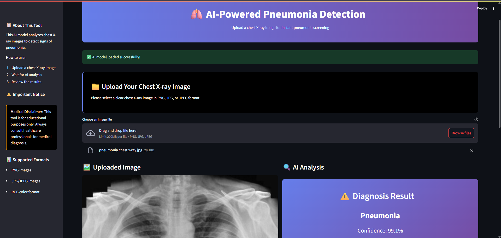

# 🫁 AI-Powered Pneumonia Detection System

A sophisticated deep learning application that analyzes chest X-ray images to detect pneumonia using computer vision and artificial intelligence. Built with Streamlit for an intuitive web interface and powered by a pre-trained neural network model.

## 🌟 Features

- **🎯 Accurate Detection**: Advanced AI model trained on chest X-ray images for pneumonia identification
- **🖥️ User-Friendly Interface**: Clean, professional web interface built with Streamlit
- **⚡ Real-time Processing**: Instant analysis and results display
- **📊 Confidence Scoring**: Detailed confidence metrics for each prediction
- **🔧 Robust Error Handling**: Comprehensive error management and user feedback
- **📱 Responsive Design**: Works seamlessly across different devices and screen sizes
- **🎨 Modern UI/UX**: Professional gradient designs and intuitive user experience

## 🚀 Demo



*Upload a chest X-ray image and get instant AI-powered pneumonia detection results*


## 🛠️ Installation

### Prerequisites

- Python 3.8 or higher
- pip package manager
- Git (for cloning the repository)

### Step 1: Clone the Repository

```bash
git clone https://github.com/Rupayan2005/ML-Project.git
cd Pneumonia Detector
```

### Step 2: Create Virtual Environment

```bash
# Create virtual environment
python -m venv venv

# Activate virtual environment
# On Windows:
venv\Scripts\activate
# On macOS/Linux:
source venv/bin/activate
```

### Step 3: Install Dependencies

```bash
pip install -r requirements.txt
```

### Step 4: Model Files

Ensure you have the following files in the `model/` directory:
- `pneumonia_classifier.h5` - Pre-trained model weights
- `labels.txt` - Class labels file

## 🎯 Usage

### Running the Application

```bash
streamlit run main.py
```

The application will open in your default web browser at `http://localhost:8501`

### Using the Interface

1. **Upload Image**: Click on the file uploader and select a chest X-ray image (PNG, JPG, or JPEG)
2. **Wait for Analysis**: The AI model will process the image automatically
3. **View Results**: See the diagnosis result with confidence score
4. **Interpret Results**: Review the confidence level and any warnings


## 📁 Project Structure

```
pneumonia-detection-ai/
├── main.py                    # Main Streamlit application
├── utils.py                   # Utility functions for image processing
├── requirements.txt           # Python dependencies
├── README.md                  # Project documentation
├── model/
│   ├── pneumonia_classifier.h5    # Pre-trained model weights
│   └── labels.txt                 # Class labels
├── demo/
│   └── demopage.png         # Demo screenshot
```

## 🧠 Model Information

### Architecture
- **Model Type**: Convolutional Neural Network (CNN)
- **Input Size**: 224 × 224 × 3 (RGB images)
- **Architecture**: Custom CNN with DepthwiseConv2D layers
- **Output**: Binary classification (Normal vs Pneumonia)

### Training Details
- **Dataset**: Chest X-ray images dataset
- **Classes**: 2 (Normal, Pneumonia)
- **Input Processing**: Image normalization and resizing
- **Threshold**: 95% confidence for positive classification


## 📊 Requirements

### Core Dependencies

```txt
streamlit>=1.28.0
tensorflow>=2.8.0
keras>=2.8.0
Pillow>=9.0.0
numpy>=1.21.0
```

## 🤝 Contributing

We welcome contributions! Please follow these steps:

1. **Fork the repository**
2. **Create a feature branch**: `git checkout -b feature/amazing-feature`
3. **Make your changes** and add tests
4. **Commit your changes**: `git commit -m 'Add amazing feature'`
5. **Push to the branch**: `git push origin feature/amazing-feature`
6. **Open a Pull Request**


## ⚠️ Medical Disclaimer

**IMPORTANT**: This application is designed for educational and research purposes only. It should not be used as a substitute for professional medical diagnosis or treatment. 

- Always consult qualified healthcare professionals for medical advice
- This tool is not FDA approved for clinical use
- Results should be interpreted by trained medical personnel
- The developer assume no responsibility for medical decisions based on this tool

## 🙏 Acknowledgments

- **TensorFlow Team**: For the machine learning framework
- **Streamlit Team**: For the amazing web app framework


---

**Made with ❤️ by [Your Rupayan]**

*Star ⭐ this repository if you found it helpful!*